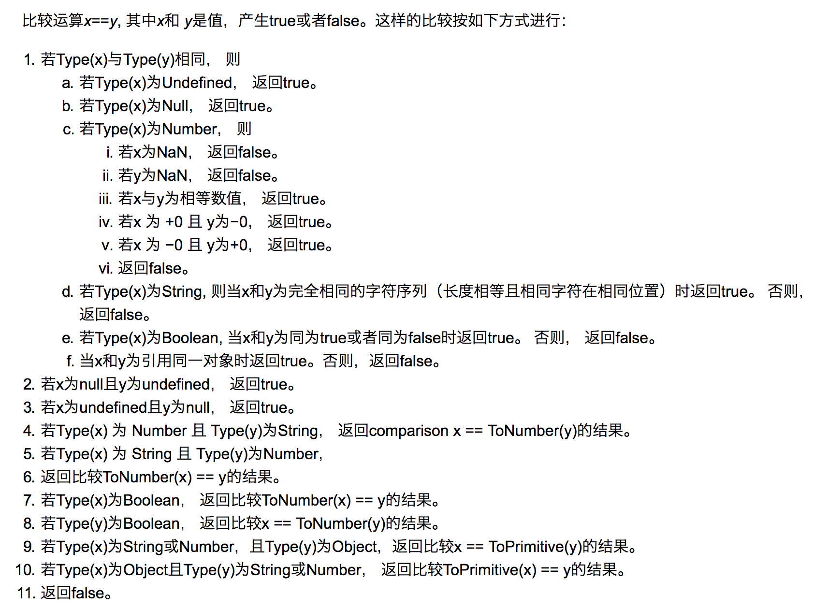

<link href="./style/index.css" rel="stylesheet">

# 题目

## 一道Promise 面试题
[从一道让我失眠的 Promise 面试题开始，深入分析 Promise 实现细节](https://juejin.cn/post/6945319439772434469)
[Promise 你真的用明白了么？](https://juejin.cn/post/6869573288478113799)

> 根据规范 25.6.1.3.2，当 Promise resolve 了一个 Promise 时，会产生一个NewPromiseResolveThenableJob，这是属于 Promise Jobs 中的一种，也就是微任务。
并且该 Jobs 还会调用一次 then 函数来 resolve Promise，这也就又生成了一次微任务。
这就是为什么会触发两次微任务的来源。

```js
Promise.resolve().then(() => {
  console.log(0); // mt1
  return Promise.resolve(4); // mt8
}).then((res) => {
  console.log(res); // mt2
})

Promise.resolve().then(() => {
  console.log(1); // mt3
}).then(() => {
  console.log(2); // mt4
}).then(() => {
  console.log(3); // mt5
}).then(() => {
  console.log(5); // mt6
}).then(() =>{
  console.log(6); // mt7
})

// 在原生 Promise 中 return Promise.reolve(4) 会多创建 2 次微任务进入队列
// output: 0、1、2、3、4、5、6 (chrome)
```

```js
function mutationCallback(mutationRecords, observer) {
  console.log('mt1')
}

const observer = new MutationObserver(mutationCallback)
observer.observe(document.body, { attributes: true })

Promise.resolve().then(() => {
  console.log('mt2')
  setTimeout(() => {
    console.log('t1')
  }, 0)
  document.body.setAttribute('test', "a")
}).then(() => {
  console.log('mt3')
})

setTimeout(() => {
  console.log('t2')
}, 0)

// output: mt2, mt1, mt3, t2, t1
```

## 串行题目
> 页面上有三个按钮，分别为 A、B、C，点击各个按钮都会发送异步请求且互不影响，每次请求回来的数据都为按钮的名字。 请实现当用户依次点击 A、B、C、A、C、B 的时候，最终获取的数据为 ABCACB。

```js
// 队列
const asyncFn = async(msg) => {
  return new Promise(resolve => {
    setTimeout(() => {
      resolve(msg);
    }, Math.random() * 2000);
  });
};

const queue = [];
let promise = Promise.resolve();
btns.forEach(btn => btn.onclick = async(ev) => {
  queue.push(asyncFn(btn.innerText));
});

(async() => {
  while(queue.length) {
    const job = queue.shift();
    console.log(await job);
  }
})();
```

```js
// then
const asyncFn = async(msg) => {
  return new Promise(resolve => {
    setTimeout(() => {
      resolve(msg);
    }, Math.random() * 2000);
  });
};

const queue = [];
let promise = Promise.resolve();
btns.forEach(btn => btn.onclick = async(ev) => {
  const p = asyncFn(btn.innerText);
  promise = promise.then(res => p);
  console.log(await promise);
});
```


## 事件循环 (Event Loop)
[我以为我很懂Promise，直到我开始实现Promise/A+规范 | 技术点评](https://juejin.cn/post/6937076967283884040)
> Event Loop 执行顺序如下所示：
>- 执行同步代码
>- 执行完所有同步代码后且执行栈为空，判断是否有微任务需要执行
>- 执行所有微任务且微任务队列为空
>- 是否有必要渲染页面
>- 执行一个宏任务

- 宏任务 (Task)
  - setTimeout
  - setInterval
  - MessageChannel
  - I/0（文件，网络）相关API
  - DOM事件监听：浏览器环境
  - setImmediate：Node环境，IE好像也支持（见caniuse数据）

- 微任务 (Microtask)
  - requestAnimationFrame：浏览器环境
  - MutationObserver：浏览器环境
  - Promise.prototype.then, Promise.prototype.catch, Promise.prototype.finally
  - process.nextTick：Node环境
  - queueMicrotask

对于Task而言，任务注册时就会进入队列，只是任务的状态还不是runnable，不具备被Event Loop捞起的条件。

Promise的微任务在 `.then / .catch` 时被注册。
Promise状态发生转移的时候变成 runnable。

>- 链式调用中，只有前一个 then 的回调执行完毕后，跟着的 then 中的回调才会被加入至微任务队列。
>- 同一个 Promise 的每个链式调用的开端会首先依次进入微任务队列。


## 设计模式
- 工厂模式
- 单例模式
- 适配器模式
- 代理模式
- 发布/订阅模式
- 策略模式
- 迭代器模式


## 函数柯里化
函数柯里化的是一个为多参函数实现递归降解的方式。其实现的核心是:

1. 要思考如何缓存每一次传入的参数
2. 传入的参数和目标函数的入参做比较
```js
// 利用闭包实现
const curry = (fn) => {
  const params = [];
  const next = (...args) => {
    params.push(...args);
    if(params.length < fn.length ) {
      return next;
    } else {
      return fn.apply(fn, params);
    }
  };
  return next;
};
```

## 数组
forEach
```js
Array.prototype.forEach = function(fn) {
  for(let i = 0; i < this.length; i++>) {
    if(this.hasOwnProperty(i)) {
      fn(this[i], i, this);
    }
  }
};
```
---
map
```js
Array.prototype.map = function(fn) {
  const result = [];
  for(let i = 0; i < this.length; i++>) {
    if(this.hasOwnProperty(i)) {
      result.push(fn(this[i], i, this));
    }
  }
  return result;
};
```
---
filter
```js
Array.prototype.filter = function(fn) {
  const result = [];
  for(let i = 0; i < this.length; i++>) {
    if(this.hasOwnProperty(i) && fn(this[i], i, this))) {
      result.push(this[i]);
    }
  }
  return result;
};
```
---
reduce
```js
Array.prototype.reduce = function(fn, initValue) {
  let result = initValue ? initValue : this[0];
  for(let i = initValue ? 0 : 1; i < this.length; i++) {
    if(this.hasOwnProperty(i)) {
      result = fn(result, this[i], i, this);
    }
  }
  return result;
};
```
---
every
```js
Array.prototype.every = function(fn) {
  for(let i = 0; i < this.length; i++>) {
    if(this.hasOwnProperty(i)) {
      if(!fn(this[i], i, this)) return false;
    }
  }
  return true;
};
```
---
some
```js
Array.prototype.some = function(fn) {
  for(let i = 0; i < this.length; i++>) {
    if(this.hasOwnProperty(i)) {
      if(fn(this[i], i, this)) return true;
    }
  }
  return false;
};
```
---
find
```js
Array.prototype.find = function(fn) {
  for(let i = 0; i < this.length; i++>) {
    if(this.hasOwnProperty(i)) {
      if(fn(this[i], i, this)) return this[i];
    }
  }
  return undefined;
};
```
---
flat
```js
Array.prototype.flat = function(n = 1) {
  n = Math.floor(n);
  const stack = [];
  for(let i = 0; i < this.length; i++) {
    if(this.hasOwnProperty(i)) {
      stack.push(this[i]);
    }
  }
  if(n <= 0) return stack;
  const result = [];
  while(stack.length) {
    const it = stack.shift();
    if(Array.isArray(it)) {
      result.push(...Array.prototype.flat.call(it, n - 1));
    } else {
      result.push(it);
    }
  }
  return result;
};
```

## 图片懒加载 / 惰性函数
实现图片懒加载其核心的思想就是将img的src属性先使用一张本地占位符，或者为空。然后真实的图片路径再定义一个data-set属性存起来，待达到一定条件的时将data-img的属性值赋给src。可以使用 `scroll` 事件或 `IntersectionObserver` API 监听。


## 实现 new 关键字
```js
const customNew = (...args) => {
  const [fn, ...rest] = args;
  const target = Object.create(fn.prototype);
  const res = fn.apply(target, rest);
  if(res && (typeof res === 'object' || typeof res === 'function')) {
    return res;
  }
  return target;
};
```

## 实现 instanceof
instanceof 运算符用于检测构造函数的 prototype 属性是否出现在某个实例对象的原型链上。
```js
const customInstanceof = (left, right) => {
  if(!left || !right) return;
  const rp = right.prototype;
  while(left = Reflect.getPrototypeOf(left)) {
    if(left === rp) return true;
  }
  return false;
};
```


## 原型和原型链

>- 所有对象都有一个属性 `__proto__` 指向一个对象，也就是原型
>- 每个对象的原型都可以通过 constructor 找到构造函数，构造函数也可以通过 prototype 找到原型
>- 所有函数都可以通过 `__proto__` 找到 Function 对象
>- 所有对象都可以通过 `__proto__` 找到 Object 对象
>- 对象之间通过 `__proto__` 连接起来，这样称之为原型链。当前对象上不存在的属性可以通过原型链一层层往上查找，直到顶层 Object 对象，再往上就是 null 了

首先，我们需要牢记两点：①`__proto__`和`constructor`属性是对象所独有的；② prototype属性是函数所独有的。但是由于JS中函数也是一种对象，所以函数也拥有`__proto__`和`constructor`属性，这点是致使我们产生困惑的很大原因之一。

`__proto__`属性是对象所独有的，都是由一个对象指向一个对象，即指向它们的原型对象（也可以理解为父对象），由这种通过`__proto__`属性来连接对象直到null的一条链即为我们所谓的原型链。

prototype属性，别忘了一点，就是我们前面提到要牢记的两点中的第二点，它是函数所独有的，它是从一个函数指向一个对象。它的含义是函数的原型对象，也就是这个函数（其实所有函数都可以作为构造函数）所创建的实例的原型对象。

`constructor`属性也是对象才拥有的，它是从一个对象指向一个函数，含义就是指向该对象的构造函数，每个对象都有构造函数（本身拥有或继承而来）。

Function这个对象比较特殊，它的构造函数就是它自己。

每个对象都可以找到其对应的`constructor`，因为创建对象的前提是需要有`constructor`，而这个`constructor`可能是对象自己本身显式定义的或者通过`__proto__`在原型链中找到的。而单从`constructor`这个属性来讲，只有prototype对象才有。

每个函数在创建的时候，JS会同时创建一个该函数对应的prototype对象，`函数创建的对象.__proto__ === 该函数.prototype，该函数.prototype.constructor===该函数本身`。


## call / apply / bind
call
```js
Function.prototype.call = function(...args) {
  const [ctx, ...rest] = args;
  if(!ctx) return this();
  const sy = Symbol();
  ctx[sy] = this;
  const res = ctx[sy](...rest);
  Reflect.deleteProperty(ctx, sy);
  return res;
};
```
---
apply
```js
Function.prototype.apply = function(ctx, rest) {
  const sy = Symbol();
  if(!ctx) return this();
  ctx[sy] = this;
  const res = ctx[sy](...rest);
  Reflect.deleteProperty(ctx, sy);
  return res;
};
```
---
bind
```js
Function.prototype.bind = function(ctx) {
  return (...rest) => {
    if(!ctx) return this();
    const sy = Symbol();
    ctx[sy] = this;
    const res = ctx[sy](...rest);
    Reflect.deleteProperty(ctx, sy);
    return res;
  }
};
```


## 封装数据类型函数
```js
const type = (() => {
  const type = Object.create(null);
  const arr = ['Number, String, Boolean, Object, Array, Symbol, Undefined, Null'];
  for(let text of arr) {
    type[`is${text}`] = function(arg) {
      return Object.prototype.toString.call(arg) === `[object ${text}]`;
    };
  }
  return type;
})();
```


## 自记忆函数
```js
const memory = function(fn) {
  const cache = {};
  return function(...args) {
    const key = JSON.stringify(args);
    if(cache[key]) return cache[key];
    cache[key] = fn.apply(fn, args);
  }
}
```


## 是否存在循环引用
```js
const cycle = function(target) {
  const set = new WeakSet(); // 缓存每一个已遍历的对象
  const _cycle = function(obj) {
    if(obj && typeof obj === 'object') {
      if(set.has(obj)) {
        return true;
      } else {
        set.add(obj);
        const keys = Object.keys(obj);
        // 每一个子属性进行递归判断
        return keys.some(key => _cycle(obj[key])); 
      }
    } else {
      return false;
    }
  };
  return _cycle(target);
}
```


## 浅拷贝
```js
// Objectt.assin
const a = {};
const b = Object.assign({}, a);

// 扩展运算符
const c = { ...a };
```

## 深拷贝
```js
// JSON
// 只支持 JSON 支持的类型，无法处理循环引用
const obj2 = JSON.parse(JSON.stringify(obj1));

// 递归
// 包含处理循环引用
const deepClone = function(obj) {
  const map = new WeakMap(); // 判断是否循环引用的缓存
  const _clone = function(target) {
    let res;
    if(target && typeof target === 'object') {
      // 对象或数组
      if(map.has(target)) {
        // 判断是否循环引用
        return map.get(target);
      } else {
        res = Array.isArray(target) ? [] : {};
        map.set(target, res);
        for(let key in target) {
          res[key] = _clone(target[key]);
        }
      }
    } else if(typeof target === 'function') {
      // 函数
      res = eval(`(${target.toString()})`);
    } else {
      // 基本类型
      res = target;
    }
    return res;
  };
  return _clone(obj);
}
```


## Promise
Promise.finally
```js
Promise.prototype.finally = function(fn) {
  return this.then(
    res => {
      Promise.resolve(fn()).then(r => r);
    },
    err => {
      Promise.reject(fn()).then(e => throw e);
    }
  );
};
```


## async / await
async/await语法糖就是使用Generator函数+自动执行器来运作的。
```js
function customAsync(genFn) {
  return new Promise((resolve, reject) => {
    const gen = genFn(); // 生成迭代器
    const step = (type, args) => {
      let next;
      try {
        next = gen[type](args);
      } catch (e) {
        return reject(e);
      }
      if(next.done) return resolve(next.value);
      Promise.resolve(next.value).then(
        val => step('next', val), 
        err => step('throw', err)
      );
    };
    step('next');
  });
}
```


## 发布 / 订阅
```js
class Events {
  constructor() {
    this.events = new Map();
  }
  on(eventName, callback) {
    if(this.events.has(eventName)) {
      this.events.get(eventName).add(callback);
    } else {
      this.events.set(eventName, new Set([callback]));
    }
  }
  off(eventName, callback) {
    const cbs = this.events.get(eventName);
    if(cbs.has(callback)) {
      cbs.delete(callback);
    }
  }
  emit(eventName, payload) {
    const cbs = this.events.get(eventName);
    if(cbs)) {
      for(let cb of cbs) {
        cb(payload);
      }
    }
  }
}
```


## 单例模式
单例模式：保证一个类仅有一个实例，并提供一个访问它的全局访问点。实现方法一般是先判断实例是否存在，如果存在直接返回，如果不存在就先创建再返回。
```js
// 闭包实现
const getSingle = function(fn) {
  let instance = null;
  return function(...args) {
    return instance || (instance = fn.apply(fn, args));
  };
};
```
```js
// Proxy 实现
const getSingle = function(fn) {
  let instance = null;
  return new Proxy(fn, {
    constructor(...args) {
      return instance || (instance = Reflect.constructor(fn, args));
    },
  });
};
```


## Object.create
```js
Object.prototype.create = function(prototype) {
  const obj = {};
  Reflect.setPrototypeOf(obj, prototype);
  return obj;
}
```


## == 类型转换
### 强制转换
> 转布尔值：
>- undefined、null、false、NaN、''、0、-0 都转为 false
>- 其他所有值都转为 true，包括所有对象

> 转数字：
>- true 为 1，false 为 0
>- null 为 0，undefined 为 NaN，symbol 报错
>- 字符串看内容，如果是数字或者进制值就正常转，否则就 NaN
>- 对象的规则隐式转换

### 隐式转换
> 对象：
>- 调用 Symbol.toPrimitive，转成功就结束
>- 调用 valueOf，转成功就结束
>- 调用 toString，转成功就结束
>- 报错

> 四则运算：
>- 只有当加法运算时，其中一方是字符串类型，就会把另一个也转为字符串类型
>- 其他运算只要其中一方是数字，那么另一方就转为数字

> == 操作符


## 类型判断
- typeof
- instanceof
- Object.prototype.toString()


## isXXX API
- window
  - window.isNaN()
  - window.isFinite()

- Number
  - Number.isInteger()
  - Number.isFinite()
  - Number.isNaN()
  - Number.isSafeInteger()

- Array
  - Array.isArray()

- Object
  - Object.isExtensible()
  - Object.isFrozen()
  - Object.isSealed()


## this
> 普通函数
>- 函数是被谁调用，那么 `this` 就是谁，没有被对象调用，`this` 就是 `window`
>- 使用 `new` 是优先级最高的，`this` 只会绑定在 `c` 上，不会被任何方式修改 `this` 指向
>- 还有种就是利用 call，apply，bind 改变 this，这个优先级仅次于 new

> 箭头函数
>- 因为箭头函数没有 this，所以一切妄图改变箭头函数 this 指向都是无效的
>- 箭头函数的 this 只取决于定义时的环境


## 闭包
假如一个函数能访问外部的变量，那么这个函数它就是一个闭包，而不是一定要返回一个函数。

一句话可以概括：闭包就是能够读取其他函数内部变量的函数，或者子函数在外调用，子函数所在的父函数的作用域不会被释放。

> 先来说下数据存放的正确规则是：局部、占用空间确定的数据，一般会存放在栈中，否则就在堆中（也有例外）。

> **局部变量才是被存储在栈上，全局变量存在静态区域上，其它都存储在堆上。*


## new
> new 操作符可以帮助我们构建出一个实例，并且绑定上 this，内部执行步骤可大概分为以下几步：
>1. 新生成了一个对象
>1. 对象连接到构造函数原型上，并绑定 this
>1. 执行构造函数代码
>1. 返回新对象（返回新对象这边有一个情况会例外，当在构造函数中返回一个对象时，内部创建出来的新对象就被我们返回的对象所覆盖，所以一般来说构建函数就别返回对象了（返回原始类型不影响））


## 作用域
> 作用域可以理解为变量的可访问性，总共分为三种类型，分别为：
>- 全局作用域
>- 函数作用域
>- 块级作用域，ES6 中的 let、const 就可以产生该作用域

一旦我们将这些作用域嵌套起来，就变成了另外一个重要的知识点「作用域链」，也就是 JS 到底是如何访问需要的变量或者函数的。

首先作用域链是在定义时就被确定下来的，和箭头函数里的 this 一样，后续不会改变，JS 会一层层往上寻找需要的内容。

作用域链的实体：`[[Scopes]]` 是个数组，作用域的一层层往上寻找就等同于遍历 `[[Scopes]]`。


## 继承
> ES5 和 6 继承的区别：
>- ES6 继承的子类需要调用 super() 才能拿到子类，ES5 的话是通过 apply 这种绑定的方式
>- 类声明不会提升，和 let 这些一致

```js
function Super() {}
Super.prototype.getNumber = function() {
  return 1
}

function Sub() {}
Sub.prototype = Object.create(Super.prototype, {
  constructor: {
    value: Sub,
    enumerable: false,
    writable: true,
    configurable: true
  }
})
let s = new Sub()
s.getNumber()
```


## 模块化
> CommonJS:
>- CommonJs 是 Node 独有的规范，当然 Webpack 也自己实现了这套东西，让我们能在浏览器里跑起来这个规范。
>- `module.exports` | `exports.xxx = yyy`

> 区别：
>- 前者支持动态导入，也就是 require(${path}/xx.js)，后者使用 import()
>- 前者是同步导入，因为用于服务端，文件都在本地，同步导入即使卡住主线程影响也不大。而后者是异步导入，因为用于浏览器，需要下载文件，如果也采用同步导入会对渲染有很大影响
>- 前者在导出时都是值拷贝，就算导出的值变了，导入的值也不会改变，所以如果想更新值，必须重新导入一次。但是后者采用实时绑定的方式，导入导出的值都指向同一个内存地址，所以导入值会跟随导出值变化


## 浮点运算精度
`0.1 + 0.2 !== 0.3`

因为 JS 采用 IEEE 754 双精度版本（64位），并且只要采用 IEEE 754 的语言都有该问题。

不止 0.1 + 0.2 存在问题，0.7 + 0.1、0.2 + 0.4 同样也存在问题。


## JS 模块规范
### AMD
- 特点：
  1. 异步加载
  2. 管理模块之间的依赖性，便于代码的编写和维护。
- 环境：浏览器环境
- 应用：requireJS是参照AMD规范实现的
- 语法：
  1. 导入：`require(['模块名称'], function ('模块变量引用'){// 代码});`
  2. 导出：`define(function (){return '值');`
- demo:
  ```js
  // a.js
  define(function (){
  　　return {
  　　　a:'hello world'
  　　}
  });
  // b.js
  require(['./a.js'], function (moduleA){
      console.log(moduleA.a); // 打印出：hello world
  });
  ```
### UMD
- 特点：
  1. 兼容AMD和commonJS规范的同时，还兼容全局引用的方式
- 环境：浏览器或服务器环境
- 应用：无
- 语法：
  1. 无导入导出规范，只有如下的一个常规写法：
- 常规写法：
  ```js
  (function (root, factory) {
    if (typeof define === 'function' && define.amd) {
      //AMD
      define(['jquery'], factory);
    } else if (typeof exports === 'object') {
      //Node, CommonJS之类的
      module.exports = factory(require('jquery'));
    } else {
      //浏览器全局变量(root 即 window)
      root.returnExports = factory(root.jQuery);
    }
  }(this, function ($) {
    //方法
    function myFunc() {};
    //暴露公共方法
    return myFunc;
  }));
  ```
### CMD
- 特点
  1. CMD是在AMD基础上改进的一种规范，和AMD不同在于对依赖模块的执行时机处理不同，CMD是就近依赖，而AMD是前置依赖。
- 环境：浏览器环境
- 应用：seajs是参照UMD规范实现的，requireJS的最新的几个版本也是部分参照了UMD规范的实现
- 语法：
  1. 导入：`define(function(require, exports, module) {});`
  2. 导出：`define(function (){return '值');`
- demo:
  ```js
  // a.js
  define(function (require, exports, module) {
  　exports.a = 'hello world';
  });
  // b.js
  define(function (require, exports, module) {
    var moduleA = require('./a.js');
    console.log(moduleA.a); // 打印出：hello world
  });
  ```
### commonJS
- 特点：
  1. 模块可以多次加载，但是只会在第一次加载时运行一次，然后运行结果就被缓存了，以后再加载，就直接读取缓存结果。要想让模块再次运行，必须清除缓存。
  2. 模块加载会阻塞接下来代码的执行，需要等到模块加载完成才能继续执行——同步加载。
- 环境：服务器环境
- 应用：nodejs的模块规范是参照commonJS实现的。
- 语法：
  1. 导入：`require('路径')`
  2. 导出：`module.exports` 和 `exports`
- 注意：`module.exports` 和 `exports` 的的区别是 `exports` 只是对 `module.exports` 的一个引用，相当于 Node 为每个模块提供一个 `exports` 变量，指向 `module.exports`。这等同在每个模块头部，有一行 `var exports = module.exports;` 这样的命令。
- demo:
  ```js
  // a.js
  // 相当于这里还有一行：var exports = module.exports;代码
  exports.a = 'Hello world';  // 相当于：module.exports.a = 'Hello world';

  // b.js
  var moduleA = require('./a.js');
  console.log(moduleA.a);     // 打印出hello world
  ```
### ES6 Module
- 特点：
  1. 按需加载（编译时加载）
  2. `import` 和 `export` 命令只能在模块的顶层，不能在代码块之中（如：if语句中），`import()` 语句可以在代码块中实现异步动态按需动态加载
- 环境：浏览器或服务器环境（以后可能支持）
- 应用：ES6的最新语法支持规范
- 语法：
  1. 导入：`import {模块名A，模块名B...} from '模块路径'`
  2. `导出：export` 和 `export default`
  3. `import('模块路径').then()` 方法
  4. `const { url, scriptElement } = import.meta` 模块信息
- 注意：`export` 只支持对象形式导出，不支持值的导出，`export default` 命令用于指定模块的默认输出，只支持值导出，但是只能指定一个，本质上它就是输出一个叫做 `default` 的变量或方法。
- 规范：
  ```js
  /*错误的写法*/
  // 写法一
  export 1;

  // 写法二
  var m = 1;
  export m;

  // 写法三
  if (x === 2) {
    import MyModual from './myModual';
  }

  /*正确的三种写法*/
  // 写法一
  export var m = 1;

  // 写法二
  var m = 1;
  export { m };

  // 写法三
  var n = 1;
  export { n as m };

  // 写法四
  var n = 1;
  export default n;

  // 写法五
  if (true) {
    import('./myModule.js')
    .then(({export1, export2}) => {
      // ...
    });
  }

  // 写法六
  Promise.all([
    import('./module1.js'),
    import('./module2.js'),
    import('./module3.js'),
  ])
  .then(([module1, module2, module3]) => {
    // ···
  });

  // 加载
  import * from 'module';

  // 整体加载
  import * as module from 'module';
  // 模块整体加载所在的那个对象（上例是circle），应该是可以静态分析的，
  // 所以不允许运行时改变。下面的写法都是不允许的
  module.foo = 'hello'; // error
  module.area = function () {}; // error


  // 复合写法
  // 但需要注意的是，写成一行以后，foo 和 bar 实际上并没有被导入当前模块，
  // 只是相当于对外转发了这两个接口，导致当前模块不能直接使用 foo 和 bar。
  export { foo, bar } from 'module';

  // 接口改名
  export { foo as myfoo } from 'module';

  // 整体导出，会忽略 export default
  export * from 'module';

  // 导出默认
  export { default } from 'module';

  // 具名接口改为默认
  export { es6 as default } from 'module';

  // 默认接口改具名
  export { default as es6 } from 'module';

  // ES2020补充
  export * as ns from 'module';
  // 等同于
  import * as ns from "mod";
  export { ns };
  ```
- MDN：
  ```js
  import defaultExport from "module-name";
  import * as name from "module-name";
  import { export } from "module-name";
  import { export as alias } from "module-name";
  import { export1 , export2 } from "module-name";
  import { foo , bar } from "module-name/path/to/specific/un-exported/file";
  import { export1 , export2 as alias2 , [...] } from "module-name";
  import defaultExport, { export [ , [...] ] } from "module-name";
  import defaultExport, * as name from "module-name";
  import "module-name";
  var promise = import("module-name");//这是一个处于第三阶段的提案。

  // 导出单个特性
  export let name1, name2, …, nameN; // also var, const
  export let name1 = …, name2 = …, …, nameN; // also var, const
  export function FunctionName(){...}
  export class ClassName {...}

  // 导出列表
  export { name1, name2, …, nameN };

  // 重命名导出
  export { variable1 as name1, variable2 as name2, …, nameN };

  // 解构导出并重命名
  export const { name1, name2: bar } = o;

  // 默认导出
  export default expression;
  export default function (…) { … } // also class, function*
  export default function name1(…) { … } // also class, function*
  export { name1 as default, … };

  // 导出模块合集
  export * from …; // does not set the default export
  export * as name1 from …; // Draft ECMAScript® 2O21
  export { name1, name2, …, nameN } from …;
  export { import1 as name1, import2 as name2, …, nameN } from …;
  export { default } from …;
  ```


## 立即执行函数 (IIFE: Imdiately Invoked Function Expression)
```js
// 形式 1
(function(...params){
  // code
}(...outerParams));

// 形式 1，有函数名
(function func(...params){
  // code
}(...outerParams));

// 形式 2
(function(){
  console.log(123);
}())

// 形式 2，有函数名
(function func(...params){
}(...outerParams))
```

## Common.js 和 es6 module 区别
  - Commonjs的require语法是运行时的，内容是在运行时确定，可以动态加载 / ES6 Module 是静态的，加载和暴露的内容都是确定的，无法动态加载
  - Commonjs输出的是值的浅拷贝 / ES6 Module 输出的是值的引用


## 防抖和节流
  - 防抖
  ```js
    // 首部执行
    function debounceHead(fn, wait) {
      let timer = null;
      return () => {
        if(!timer) {
          fn();
        } else {
          clearTimeout(timer);
        }
        timer = setTimeout(() => {
          timer = null;
        }, wait);
      }
    }

    // 尾部执行
    function debounceTail(fn, wait) {
      let timer = null;
      
      return () => {
        if(timer) {
          clearTimeout(timer);
        }
        timer = setTimeout(() => {
          fn();
          timer = null;
        }, wait);
      };
    }
  ```
  - 节流
  ```js
    // 首部执行
    function throttleHead(fn, wait) {
      let timer = null;

      return () => {
        if(!timer) {
          fn();
          timer = setTimeout(() => {
            timer = null;
          }, wait);
        }
      };
    }

    // 尾部执行
    function throttleTail(fn, wait) {
      let timer = null;

      return () => {
        if(!timer) {
          timer = setTimeout(() => {
            fn();
            timer = null;
          }, wait)
        }
      };
    }
  ```


## js的new操作符做了哪些事情
new 操作符新建了一个空对象，这个对象原型指向构造函数的prototype，执行构造函数后返回这个对象。


## 说说前端中的事件流
HTML中与javascript交互是通过事件驱动来实现的，例如鼠标点击事件onclick、页面的滚动事件onscroll等等，可以向文档或者文档中的元素添加事件侦听器来预订事件。想要知道这些事件是在什么时候进行调用的，就需要了解一下“事件流”的概念。
什么是事件流：事件流描述的是从页面中接收事件的顺序,DOM2级事件流包括下面几个阶段。

事件捕获阶段

处于目标阶段

事件冒泡阶段

addEventListener：addEventListener 是DOM2 级事件新增的指定事件处理程序的操作，这个方法接收3个参数：要处理的事件名、作为事件处理程序的函数和一个布尔值。最后这个布尔值参数如果是true，表示在捕获阶段调用事件处理程序；如果是false，表示在冒泡阶段调用事件处理程序。


## mouseover和mouseenter的区别
mouseover：当鼠标移入元素或其子元素都会触发事件，所以有一个重复触发，冒泡的过程。对应的移除事件是mouseout

mouseenter：当鼠标移除元素本身（不包含元素的子元素）会触发事件，也就是不会冒泡，对应的移除事件是mouseleave


## js的各种位置，比如clientHeight,scrollHeight,offsetHeight ,以及scrollTop, offsetTop,clientTop的区别？
clientHeight：表示的是可视区域的高度，不包含border和滚动条

offsetHeight：表示可视区域的高度，包含了border和滚动条

scrollHeight：表示了所有区域的高度，包含了因为滚动被隐藏的部分。

clientTop：表示边框border的厚度，在未指定的情况下一般为0

scrollTop：滚动后被隐藏的高度，获取对象相对于由offsetParent属性指定的父坐标(css定位的元素或body元素)距离顶端的高度。


## 监听一个变量的变化，怎么做
1. ES5: Object.defineProperty()
2. ES6: Reflect.defineProperty() | Proxy


## ==和===、以及Object.is的区别
- ==：存在类型转换
- ===：左右两边类型相等，值相等
- Object.is 主要区别是 NaN/0/-0的区别
  ```js
  NaN === NaN // false
  -0 === 0 // true

  Object.is(NaN, NaN) // true
  Object.is(0, -0) // false
  ```