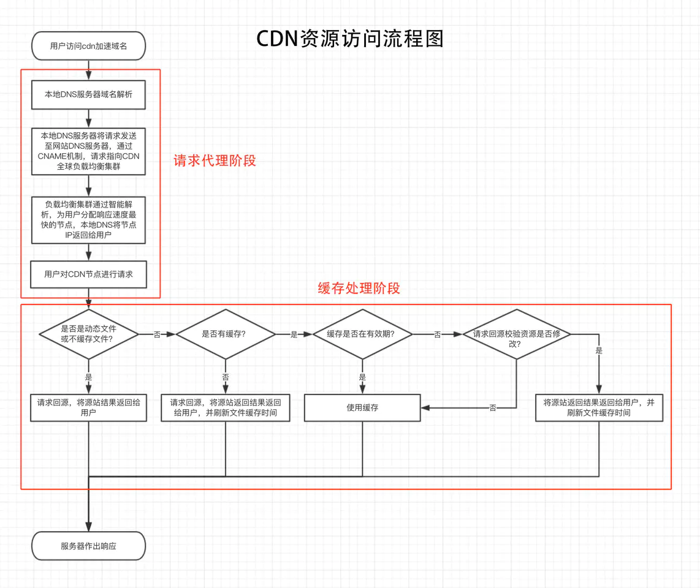
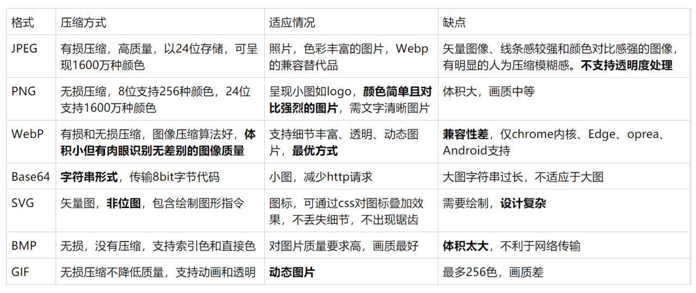
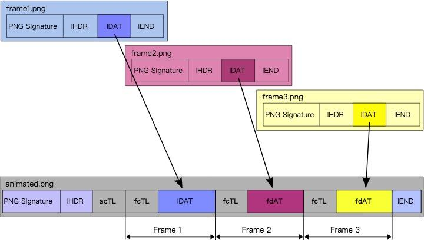
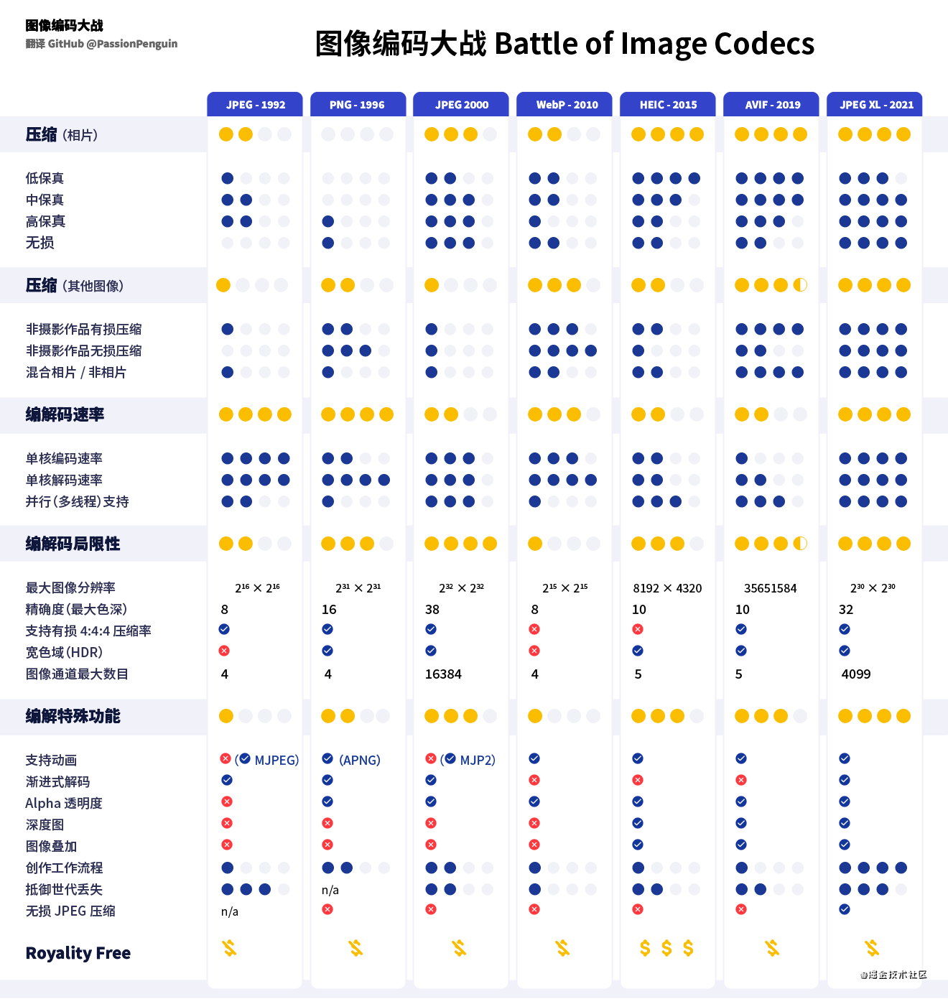

# 计算机基础
## OSI 七层模型
  1. 应用层
  2. 会话层
  3. 表示层
  4. 传输层
  5. 网络层
  6. 数据链路层
  7. 物理层


## IP/TCP 四层模型
  1. 应用层
  2. 传输层
  3. 网络层
  4. 网际接口层


## 进程、线程、协程
进程：计算机独立运行和分配资源的最小单位

线程：计算机任务调度的最小单位，各个线程之间共享相同进程内的资源

协程：一种基于线程之上，但又比线程更加轻量级的存在，解决长时间的I/O操作减少开销

一个程序含有一个或多个进程，一个进程含有一个或多个线程

进程间通信：
  - 无名管道(pipe)：半双工通信
  - 高级管道(popen)
  - 命名管道(named pipe)
  - 消息队列(message queue)
  - 信号量(semphore)
  - 信号(sinal)
  - 共享内存(shared memory)
  - 套接字(socket)：socket = ip: port


## 数据库索引
作用：加快查询速度

b+树

缺点：增加空间成本，影响怎删改查的效率


## DNS (Domain Name System)
### 名词
> A: Address，域名指向的IP地址，一个域名可以有多个A记录。
>> 例：`www.xxx.com` --> 11.22.33.44
>
> NS：Name Server，保存下一级域名信息的服务器地址
>
> MX：Mail eXchange，接受电子邮件的服务器地址
>
> CNAME：Canonical Name，返回另一个域名，令当前查询域名跳去该域名，多个域名->服务器的映射。一个网址可以有多个CNAME，可以理解为就是域名转发
>> 例：`www.a.com` --> 11.11.11.11 <br>
>> `www.b.com` --> `www.a.com` <br>
>> `www.c.com` --> `www.a.com` <br>
>
> PTR： Pointer Record，只用于ip地址查询域名

### DNS由下面三个部分组成
> 名称解析器（resolver）
> 
> 域名空间（domain name space）
> 
> 名称服务器（name server）

主要作用是将主机名和域名转换为IP地址，他是一个分布式数据库，功能是联系域名和ip地址。域名与ip的对应关系，被称为记录(record)，可分为各种类型

DNS是一种分层结构，在整个互联网中组成一个树状系统，顶层是系统的根域名，下层为TLD以及二级域名，叶子就构成了所谓的FQDN（Fully Qualified Domain Names），根域名通常使用"."来表示，其实际上也是由域名组成，全世界目前有13组域名根节点，由少数几个国家进行管理，而国内仅有几台根节点镜像。

### DNS解析流程
```
zzzz.yyyy.xxxx.com(.)
四级  三级 二级 顶级 根
```
DNS 解析 `tlab.cloud.tencent.com `
  1. 检查浏览器缓存（浏览器访问）
  2. 操作系统缓存 DNS 缓存
  3. 本地 hosts 文件：通过修改本地 hosts 文件，变更访问对应域名的 ip
  4. DNS 服务器缓存
  5. DNS 服务器递归查找，想根域名服务器(Root Server)请求解析
     1. 询问根域名，获取顶级域名(TLD) .com 的 NS(Name Server) 和 A(Address)，NS为顶级域名的名字，A即NS对应的ip地址
     2. 询问顶级域名，获取二级域名 .tencnet.com 的NS 和 A
     3. 询问二级域名，获取三级域名 .cloud.tencent.com 的NS 和 A
     4. 询问三级域名，获取四级域名 .tlab.cloud.tencent.com 的NS 和 A
     5. 最后，将tlab.cloud.tencent.com的ip地址返回给用户，并且缓存
     6. 用户获取到真正的ip地址，并且缓存


### DNS优化
  1. DNS prefetching：DNS 预解析
      ```html
      <!-- 
        DNS 预读取是一项使浏览器主动去执行域名解析的功能，其范围包括文档的所有链接，无论是图片的，CSS 的，还是 JavaScript 等其他用户能够点击的 URL。
        因为预读取会在后台执行，所以 DNS 很可能在链接对应的东西出现之前就已经解析完毕。这能够减少用户点击链接时的延迟。
      -->
      <meta http-equiv="x-dns-prefetch-control" content="on">

      <!-- or -->

      <!-- 
        首先，dns-prefetch 仅对跨域域上的 DNS查找有效
        其次，还可以通过使用 HTTP链接字段将 dns-prefetch（以及其他资源提示）指定为 HTTP标头
        第三，考虑将 dns-prefetch 与 preconnect(预连接)提示配对。尽管 dns-prefetch 仅执行 DNS查找，但preconnect 会建立与服务器的连接。如果站点是通过HTTPS服务的，则此过程包括DNS解析，建立TCP连接以及执行TLS握手。将两者结合起来可提供进一步减少跨域请求的感知延迟的机会。
      -->
      <link rel="dns-prefetch" href="https://fonts.googleapis.com">

      <!-- or -->
      <!-- Link: <https://fonts.gstatic.com/>; rel=dns-prefetch -->
      ```
  
  2. 域名收敛：减少跨域请求数量


## CDN原理
[CDN是什么](https://www.zhihu.com/question/36514327?rf=37353035)
> CDN的全称是(Content Delivery Network)，即内容分发网络。
> 
> 其目的是通过在现有的Internet中增加一层新的CACHE(缓存)层，将网站的内容发布到最接近用户的网络“边缘”的节点，使用户可以就近取得所需的内容，提高用户访问网站的响应速度。
> 
> CDN网络是在用户和服务器之间增加Cache层，主要是通过接管 DNS 实现，将用户的请求引导到 Cache 上获得源服务器的数据，从而降低网络的访问的速度。

### 系统组成
  - 分发服务系统<br>
    最基本的工作单元就是Cache设备，cache（边缘cache）负责直接响应最终用户的访问请求，把缓存在本地的内容快速地提供给用 户。同时cache还负责与源站点进行内容同步，把更新的内容以及本地没有的内容从源站点获取并保存在本地。Cache设备的数量、规模、总服务能力是衡 量一个CDN系统服务能力的最基本的指标

  - 负载均衡系统<br>
    主要功能是负责对所有发起服务请求的用户进行访问调度，确定提供给用户的最终实际访问地址。两级调度体系分为全局负载均衡（GSLB）和本地负载均衡（SLB）。GSLB主要根据用户就近性原则，通过对每个服务节点进行“最优”判断，确定向用户提供服务的cache的物理位置。SLB主要负责节点内部的设备负载均衡


  - 运营管理系统<br>
    分为运营管理和网络管理子系统，负责处理业务层面的与外界系统交互所必须的收集、整理、交付工作，包含客户管理、产品管理、计费管理、统计分析等功能。

### CDN 过程
  - 用户访问未使用CDN缓存资源的过程为：
    1. 浏览器通过前面提到的过程对域名进行解析，以得到此域名对应的IP地址；
    1. 浏览器使用所得到的IP地址，向域名的服务主机发出数据访问请求；
    1. 服务器向浏览器返回响应数据

  - 使用CDN后：
    1. 当用户点击网站页面上的内容URL，经过本地DNS系统解析，DNS系统会最终将域名的解析权交给CNAME指向的CDN专用DNS服务器。
    2. CDN的DNS服务器将CDN的全局负载均衡设备IP地址返回用户。
    3. 用户向CDN的全局负载均衡设备发起内容URL访问请求。
    4. CDN全局负载均衡设备根据用户IP地址，以及用户请求的内容URL，选择一台用户所属区域的区域负载均衡设备，告诉用户向这台设备发起请求。
    5. 区域负载均衡设备会为用户选择一台合适的缓存服务器提供服务，选择的依据包括：根据用户IP地址，判断哪一台服务器距用户最近；根据用户所请求的URL中携带的内容名称，判断哪一台服务器上有用户所需内容；查询各个服务器当前的负载情况，判断哪一台服务器尚有服务能力。基于以上这些条件的综合分析之后，区域负载均衡设备会向全局负载均衡设备返回一台缓存服务器的IP地址。
    6. 全局负载均衡设备把服务器的IP地址返回给用户
    7. 用户向缓存服务器发起请求，缓存服务器响应用户请求，将用户所需内容传送到用户终端。如果这台缓存服务器上并没有用户想要的内容，而区域均衡设备依然将它分配给了用户，那么这台服务器就要向它的上一级缓存服务器请求内容，直至追溯到网站的源服务器将内容拉到本地。

### 引入 CDN
  1. 服务器域名：`www.credit.com`
  2. 设置 CNAME：`www.credit.com --> cdn.credit.com` <br>
  A 记录：`cdn.credit.com --> 22.22.22.22`

### 优化原理
  - 负载均衡
    1. 根据用户IP地址，判断哪一台服务器距离用户最近
    2. 根据用户所请求的URL中携带的内容名称，判断哪一台服务器上有用户所需内容
    3. 查询各个服务器的负载情况，判断哪一台服务器的负载较小

  - 缓存

### CDN 缓存


### 缓存更新
  - 资源url参数加时间戳，重新使CDN边缘节点同步源服务器最新数据
  - 调用CDN服务商提供的刷新缓存接口，强制CDN节点上的数据缓存过期


## Web图片
### 分类
- 无压缩。无压缩的图片格式不对图片数据进行压缩处理，能准确地呈现原图片。BMP格式就是其中之一。
- 无损压缩。压缩算法对图片的所有的数据进行编码压缩，能在保证图片的质量的同时降低图片的尺寸。png是其中的代表。
- 有损压缩。压缩算法不会对图片所有的数据进行编码压缩，而是在压缩的时候，去除了人眼无法识别的图片细节。因此有损压缩可以在同等图片质量的情况下大幅降低图片的尺寸。其中的代表是jpg。

### 对比

- PNG <br>
  
  ```
  PNG Signature 是文件标识，用于校验文件格式是否为 PNG。内容固定为：0x89, 0x50, 0x4e, 0x47, 0x0d, 0x0a, 0x1a, 0x0a
  IHDR 是文件头数据块，包含 PNG 图像的基本信息，例如图像的宽高等信息
  IDAT 是图像数据块，最核心，存储具体的图像数据
  IEND 是结束数据块，标示图像结束
  ```
- APNG：Web帧动画，基于 png 格式扩展的动画格式 
  - 相比于gif，画质更好，尤其对于带透明度的图片。具体比较请自行google
  - 本身其实是一个png文件，在不支持apng的设备上时，能降级显示一个png静图（后面会讲到）
  - 可以直接作为img标签插入到网页中去，无需逻辑控制动画，开发成本低
  - 直接由设计师产出，设计还原度100%
  
  
- AVIF：AVIF 是一种从 AV1 视频的关键帧派生的新图像格式。
  - 支持HDR， 透明度（即支持alpha通道）和宽色域。
  - 它提供了最高的无损和有损压缩的可能。
  - 它是以免版税的格式创建的，因此开发者不必面对法律或财务问题，能够加快推进使用的速度。
  - 背靠诸如Amazon, Google, Apple, Intel, Samsung等大公司，因此不存在缺少资源的问题。
- JPEG 2000： JPEG 小组，这是 JPEG 编码继承者中最早初露头角的一位，不过仅被 Safari 5+ 支持
- JPEG XL： JPEG 小组，下一代编码但不被任何浏览器支持
- HEIC：MPEG 小组，基于 HEVC，支持在 iOS 原生应用程序使用，但是不被任何一个包括 Safari 在内的浏览器支持
- WebP2：Google，一个针对 WebP 的实验性质的成功尝试，主要目标是达到与 AVIF 相似的压缩率，同时保持更快的编码和解码速度。


### 图像编码



### 判断浏览器是否支持 webp 格式
  1. HTMLCanvasElement.toDataURL(type)：（canvas宽高不为0）若传入的 type 不支持，则返回 `data:image/webp;` 开头的字符串
  2. HTTP Request Header -> Accept: image/webp, image/apng, image/avif, ...
  3. 加载一张 webp 图片，如果能获取到图片的宽高，则支持 webp 格式