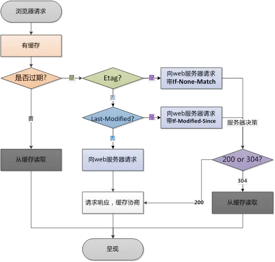

## 题目
1. ### 对 tree-shaking 的了解
  - 用于移除 js 上下文中的未引用代码，依赖于 ES6 中模块系统中的静态结构特性，如 import / export
  - ES6模块依赖关系是确定的，和运行时的状态无关，可以进行可靠的静态分析，这就是tree-shaking的基础
  - ES6 module 特点：
    >- 只能作为模块顶层的语句出现
    >- import 的模块名只能是字符串常量
    >- import binding 是 immutable的
  - babel默认会把import编译成IIFE形式的函数，无法被Tree-Shaking
  - babel需要配置 { modules: false }, package.json 配置 { "sideEffect": false }
  - webpack偏向于前端工程，rollup偏向于js库

2. ### Common.js 和 es6 module 区别
  - Commonjs的require语法是运行时的，内容是在运行时确定，可以动态加载 / ES6 Module 是静态的，加载和暴露的内容都是确定的，无法动态加载
  - Commonjs输出的是值的浅拷贝 / ES6 Module 输出的是值的引用

3. ### 缓存策略
  ##### 提升数据交换的性能，缓解服务器的压力
  
  - 缓存大致可归为两类：私有缓存（只能用于单独用户）、共享缓存（能否被多个用户使用）
  - 强缓存
    - 直接从缓存数据库中取出资源，无需再发送到服务器上
    - http中相关header为 Expires / Cache-Control，Cache-Control优先级高于 Expires
    - Expires 是 HTTP1.0 的产物，值为绝对时间，表示资源的过期时间
    - Cache-Control 分缓存请求指令、缓存响应指令
      >- `public 响应可被任何对象缓存`
      >- `private 响应只能被单个用户缓存，不能作为共享缓存`
      >- `no-cache 在发布缓存副本之前，强制要求缓存把请求提交给原始服务器进行验证(协商缓存验证)`
      >- `no-store 不使用任何缓存`
      >- `max-age=\<seconds\> 缓存的最大周期，相对时间`
      >- `s-max-age=\<seconds\> 覆盖max-age或者Expires头，但是仅适用于共享缓存(比如各个代理)，私有缓存会忽略它`
    - 强制缓存状态码为 200
      >- (from memory cache) 缓存资源在内存中，浏览器（或页面标签）关闭后内存中的缓存就会被释放，重新打开页面取不到该缓存
      >- (from disk cache) 缓存资源在硬盘中，浏览器（或页面标签）关闭后硬盘中的缓存不会消失，下次进入页面还能从硬盘中获取

      ```sequence
        客户端 -> 缓存仓库: 请求数据

        缓存仓库 -> 客户端: 没有缓存，或缓存过期

        客户端 -> 服务器: 客户端继续请求服务器获取数据

        服务器 -> 客户端: 数据从服务器给到客户端

        客户端 -> 缓存仓库: 将数据写入缓存仓库
      ```
  ---
  - 对比缓存（协商缓存）
    - 经过服务器确认是否使用缓存的机制，状态码为 304 (not modified)
    - HTTP相关header为 Last-Modified / If-Modified-Since, Etag / If-None-Match，Etag 的优先级高于 Last-Modified
    - Last-Modified / If-Modified-Since
      >- 由于精确度比  ETag 要低，所以这是一个备用机制
      >- 包含有  If-Modified-Since 或 If-Unmodified-Since 首部的条件请求会使用这个字段
      >- 浏览器第一次访问一个资源时，服务器会在response header中返回一个Last-Modified，代表这个资源最后的修改时间，当浏览器再次访问这个资源的时候，会在request header中带上 If-Modified-Since，值为上次请求时服务器返回的 Last-Modified 的值，然后服务器根据资源上次修改的时间确认资源在这段期间内是否更改过，如果没有，则返回304，如果有，则返回200并返回最新的资源。
    - Etag / If-None-Match
      >- Etag是通过一个校验码来对比资源是否更改过的，而不是通过资源的修改时间
      >- 当一个资源修改时，其校验码也会更改。当浏览器请求资源时，服务器会返回一个Etag字段，然后浏览器下一次请求时，会带上 If-None-Match ，值为上次服务器返回的Etag的值，服务器经过校验码的对比后决定返回200或304
      >- If-None-Match 的值中有个 W/ 前缀，这个其实不用去关心，这个是用来提示应该采用弱比较算法

      ```sequence
      客户端 -> 服务器: 请求数据，带入缓存对比标志

      服务器 -> 客户端: 经过对比客户端提供的标志，确认缓存可用，返回304

      客户端 -> 缓存仓库: 获取缓存资源

      缓存仓库 -> 客户端: 返回缓存资源
      ```

4. ### HTTP 状态码
  - 1xx Informational 消息，临时响应
    - **100** *Continue* 客户端应当继续发送请求
    - **101** *Switching Protocols* 服务器已经理解了客户端请求，并通过Upgrade header通知客户端采用不同的协议完成这个请求，如Websocket
      >- `Connection: Upgrade`
      >- `Upgrade: websocket`
    - **102** *Processing* 由WebDAV(RFC 2518)扩展的状态码，代表处理将被继续执行
  - 2xx Successful 成功，表示请求成功被服务器接收并理解
    - **200** *OK* 请求已成功，请求所希望的响应头或数据体随响应返回
    - **201** *Created* 请求已经被实现，而且有一个新的资源已经依据请求的需要而建立，且其 URI 已经随Location 头信息返回
    - **202** *Accepted* 服务器已接受请求，但尚未处理
    - **203** *Non-Authoritative Information* 服务器已成功处理了请求，但返回的实体头部元信息不是在原始服务器上有效的确定集合，而是来自本地或者第三方的拷贝
    - **204** *No Content* 服务器成功处理了请求，但不需要返回任何实体内容，并且希望返回更新了的元信息
    - **205** *Rest Content* 服务器成功处理了请求，且没有返回任何内容，但是与204响应不同，返回此状态码的响应要求请求者重置文档视图
    - **206** *Partial Content* 服务器已经成功处理了部分 GET 请求，该请求必须包含 Range 头信息来指示客户端希望得到的内容范围，并且可能包含 If-Range 来作为请求条件
      >- `Range: bytes=200-100, 2000-3000, 4500-`
      >- `If-Range: <day-name>, <day> <month> <year> <hour>:<minute>:<second> GMT`
      >- `Content-Range: bytes 200-1000/3000 | bytes 200-1000/*`
      >- `Content-Type: MIME`
      >- `Content-Length`
    - **207** *Multi-Status* 由WebDAV(RFC 2518)扩展的状态码，代表之后的消息体将是一个XML消息，并且可能依照之前子请求数量的不同，包含一系列独立的响应代码
  - 3xx Redirection 重定向
    - **301** *Moved Permanently* 被请求的资源已永久移动到新位置，并且将来任何对此资源的引用都应该使用本响应返回的若干个URI之一，默认会被缓存
      >- `Location: <new-url>`
    - **302** *Move Temporarily* 请求的资源临时从不同的URI响应请求，默认以 GET 重新请求
    - **303** *See Other* 对应当前请求的响应可以在另一个 URL 上被找到，而且客户端应当采用 GET 的方式访问那个资源
    - **304** *Not Modified* 如果客户端发送了一个带条件的 GET 请求且该请求已被允许，而文档的内容（自上次访问以来或者根据请求的条件）并没有改变，则服务器应当返回这个状态码
    - **305** *Use Proxy* 被请求的资源必须通过指定的代理才能被访问
    - **306** *Switch Proxy* 在最新版的规范中，306状态码已经不再被使用
    - **307** *Temporary Redirect* 与302一致，但不允许HTTP方法改变
    - **308** *Permanent Redirect* 与301一致，但不允许HTTP方法改变
  - 4xx Client Error 客户端错误
    - **400** *Bad Request* 当前请求无法被服务器理解
      >- `语义有误`
      >- `请求参数有误`
    - **401** *Unauthorized* 当前请求需要用户验证
      >- `Authorization: <type> <credentials>`
      >- `WWW-Authenticate: <type> realm=<realm>`
    - **402** *Payment Required* 该状态码是为了将来可能的需求而预留的
    - **403** *Forbidden* 服务器已经理解请求，但是拒绝执行它
    - **404** *Not Found* 请求失败，请求所希望得到的资源未被在服务器上发现
    - **405** *Method Not Allowed* 请求行中指定的请求方法不能被用于请求相应的资源
      >- `Allow: <http-methods>`
    - **406** *Not Acceptable* 请求的资源的内容特性无法满足请求头中的条件，因而无法生成响应实体
    - **407** *Proxy Authentication Required* 与401响应类似，只不过客户端必须在代理服务器上进行身份验证
      >- `Proxy-Authorization: <type> <credentials>`
    - **408** *Request Timeout* 请求超时
    - **409** *Conflict* 由于和被请求的资源的当前状态之间存在冲突，请求无法完成
    - **410** *Gone* 被请求的资源在服务器上已经不再可用，而且没有任何已知的转发地址
    - **411** *Length Required* 服务器拒绝在没有定义 Content-Length 头的情况下接受请求
    - **412** *Precondition Failed* 服务器在验证在请求的头字段中给出先决条件时，没能满足其中的一个或多个
    - **413** *Request Entity Too Large* 服务器拒绝处理当前请求，因为该请求提交的实体数据大小超过了服务器愿意或者能够处理的范围
    - **414** *Request-URI Too Long* 请求的URI 长度超过了服务器能够解释的长度，因此服务器拒绝对该请求提供服务
    - **415** *Unsupported Media Type* 对于当前请求的方法和所请求的资源，请求中提交的实体并不是服务器中所支持的格式，因此请求被拒绝
    - **416** *Requested Range Not Satisfiable* 如果请求中包含了 Range 请求头，并且 Range 中指定的任何数据范围都与当前资源的可用范围不重合，同时请求中又没有定义 If-Range 请求头，那么服务器就应当返回416状态码
    - **417** *Expectation Failed* 在请求头 Expect 中指定的预期内容无法被服务器满足，或者这个服务器是一个代理服务器，它有明显的证据证明在当前路由的下一个节点上，Expect 的内容无法被满足
      >- `Expect: 100-continue`
    - **418** *I'm a teapot* 超文本咖啡壶控制协议RFC 2324
    - **421** *Misdirected Request* 请求被指向到无法生成响应的服务器（比如由于连接重复使用）
    - **422** *Unprocessable Entity* 请求格式正确，但是由于含有语义错误，无法响应
    - **423** *Locked* 当前资源被锁定
    - **424** *Failed Dependency* 由于之前的某个请求发生的错误，导致当前请求失败
    - **425** *Too Early* 代表服务器不愿意冒风险来处理该请求，原因是处理该请求可能会被“重放”，从而造成潜在的重放攻击
    - **426** *Upgrade Required* 客户端应当切换到TLS/1.0
    - **449** *Retry With* 由微软扩展，代表请求应当在执行完适当的操作后进行重试
    - **451** *Unavailable For Legal Reasons* 该请求因法律原因不可用
  - 5xx Server Error 服务器错误
    - **500** *Internal Server Error* 服务器遇到了一个未曾预料的状况，导致了它无法完成对请求的处理
    - **501** *Not Implemented* 服务器不支持当前请求所需要的某个功能
    - **502** *Bad Gateway* 作为网关或者代理工作的服务器尝试执行请求时，从上游服务器接收到无效的响应
    - **503** *Service Unavailable* 由于临时的服务器维护或者过载，服务器当前无法处理请求
    - **504** *Gateway Timeout* 作为网关或者代理工作的服务器尝试执行请求时，未能及时从上游服务器（URI标识出的服务器，例如HTTP、FTP、LDAP）或者辅助服务器（例如DNS）收到响应
    - **505** *HTTP Version Not Supported* 服务器不支持，或者拒绝支持在请求中使用的 HTTP 版本
    - **506** *Variant Also Negotiates* 由《透明内容协商协议》（RFC 2295）扩展，代表服务器存在内部配置错误
    - **507** *Insufficient Storage* 服务器无法存储完成请求所必须的内容
    - **509** *Bandwidth Limit Exceeded* 服务器达到带宽限制
    - **510** *Not Extended* 获取资源所需要的策略并没有被满足
  - 6xx 同 5xx
    - **600** *Unparseable Response Headers* 源站没有返回响应头部，只返回实体内容