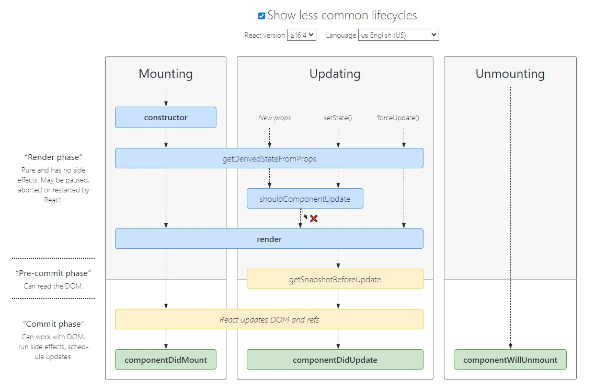

# React
## 生命周期


## Hooks
- useActionState，是一个可以根据某个表单动作的结果更新 state 的 Hook
- useCallback
- useContext
- useDebugValue
- useDeferredValue，是一个 React Hook，可以让你延迟更新 UI 的某些部分
- useEffect
- useId，是一个 React Hook，可以生成传递给无障碍属性的唯一 ID
- useImperativeHandle，是 React 中的一个 Hook，它能让你自定义由 ref 暴露出来的句柄
- useInsertionEffect，可以在布局副作用触发之前将元素插入到 DOM 中
- useLayoutEffect，是 useEffect 的一个版本，在浏览器重新绘制屏幕之前触发
- useMemo，是一个 React Hook，它在每次重新渲染的时候能够缓存计算的结果
- useOptimistic，是一个 React Hook，它可以帮助你更乐观地更新用户界面

  场景，调用 API 修改某个字段的值时，UI 可以马上修改，API 调用成功后

- useReducer，是一个 React Hook，它允许你向组件里面添加一个 reducer
- useRef
- useState
- useSyncExternalStore，是一个让你订阅外部 store 的 React Hook
- useTransition，是一个帮助你在不阻塞 UI 的情况下更新状态的 React Hook

## APIs
- memo，允许你的组件在 props 没有改变的情况下跳过重新渲染
  ```jsx
  const MemoizedComponent = memo(SomeComponent, arePropsEqual?)
  ```

- startTransition，可以在不阻塞 UI 的情况下更新 state
- use，是一个 React API，它可以让你读取类似于 Promise 或 context 的资源的值

## 组件懒加载
```jsx
import { lazy } from 'react';

const MarkdownPreview = lazy(() => import('./MarkdownPreview.js'));

<Suspense fallback={<Loading />}>
  <h2>Preview</h2>
  <MarkdownPreview />
</Suspense>
```

## Fiber
React 会将 render 处理成 React.createElement，生成的结果就是 React Element，也就是 VDOM

React 会把 VDOM 转换成 Fiber 结构的，这个过程称为 reconcile

## React19
- useTransition/useOptimistic/useActionState/useFormStatus
- API: use
- 服务器组件
- ref 作为属性可以在 props 访问，未来不再需要 forwardRef
- `<Content>` 简化，`<Content.Provider>` => `<Content>`
- refs 支持返回函数，可以进行清理操作
- useDeferredValue 增加初始化 value
- 支持文档元数据，自动提升 title/link/meta 等元素到 head 中
- 支持样式表